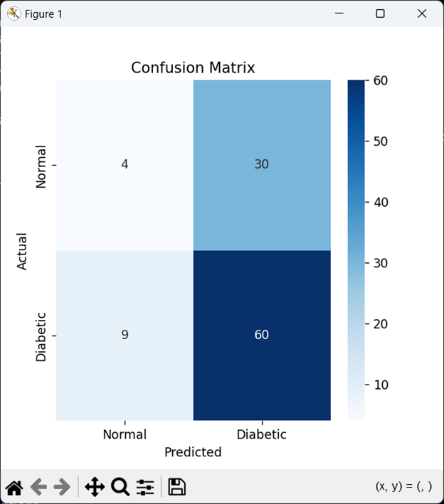
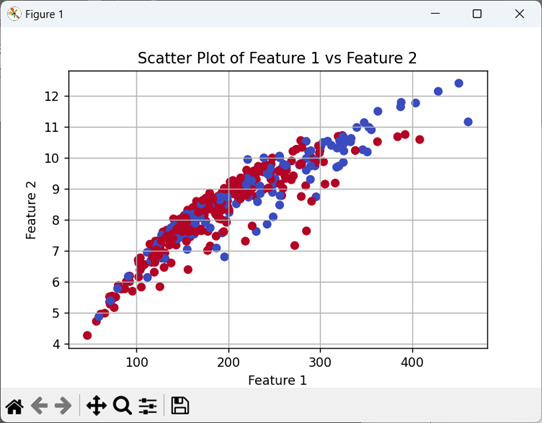
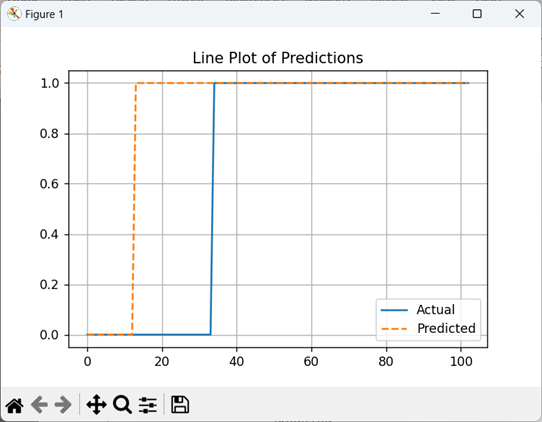
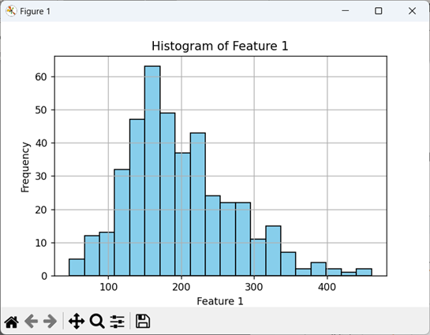
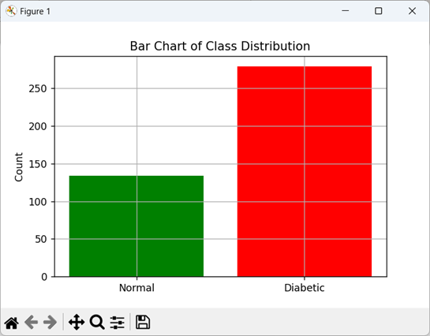

<h1>🧪 Diabetic Retinopathy Detection using Random Forest</h1>
This project performs <b>binary classification</b> of retinal fundus images to detect <b>Diabetic Retinopathy (DR)</b> using <b>GLCM texture features and a Random Forest Classifier</b>.

<h2>📌 Project Objective</h2>
To detect whether a retinal image belongs to a <b>Normal</b> patient or indicates <b>Diabetic Retinopathy</b>, based on texture analysis of the <b>Green Channel</b>.

<h2>🗂️ Dataset</h2>
<ul>
<li><b>Source:</b> IEEE Dataport – IDRiD Dataset</li>
<li><b>Images:</b> High-resolution retinal images</li>
<li><b>Labels:</b> Retinopathy grading (converted to binary: Normal = 0, DR = 1)</li>
</ul>

<h2>🔧 Tech Stack</h2>
<ul>
<li><b>Languages:</b> Python</li>
<li><b>Libraries:</b> OpenCV, NumPy, Pandas, Matplotlib, Seaborn, scikit-learn, skimage</li>
</ul>

<h2>🔍 Key Steps</h2>
<ol>
<li><b>Import Libraries</b></li>
<li><b>Set Paths & Load Dataset</b></li>
<li><b>Preprocess Images</b> (resize, enhance green channel using CLAHE)</li>
<li><b>Extract GLCM Features</b></li>
<li><b>Train Random Forest Classifier</b></li>
<li><b>Evaluate Model</b> (accuracy, sensitivity, specificity, F1 score)</li>
<li><b>Visualize Results</b></li>
</ol>

<h2>📊 Model Performance</h2>
<table>
<tr><th>Metric</th><th>Score</th></tr>
<tr><td>Accuracy</td><td>62.14%</td></tr>
<tr><td>Sensitivity (Recall)</td><td>86.96%</td></tr>
<tr><td>Specificity</td><td>11.76%</td></tr>
<tr><td>F1 Score</td><td>0.207</td></tr>
</table>

<h2>📈 Sample Visualizations</h2>
Below are key visual representations that were generated during the project to analyze and evaluate the data and model performance:

<h3>🔹 1. Confusion Matrix</h3>

This matrix displays the number of correct and incorrect predictions made by the model, broken down by each class. It highlights:

<ul>
<li>60 correctly classified diabetic images</li>
<li>4 correctly classified normal images</li>
<li>Misclassifications are also shown, indicating areas where the model could be improved.</li>
</ul>

<h3>🔹 2. Scatter Plot of Features</h3>

This plot visualizes the relationship between <b>Feature 1</b> and <b>Feature 2</b> extracted from the <b>GLCM</b>. It shows a clear trend and slight clustering of the two classes (Normal and Diabetic).

<h3>🔹 3. Line Plot of Predictions</h3>

This line graph compares the actual labels with the model's predictions, helping to visualize how the model’s output aligns with the true data.

<h3>🔹 4. Histogram of Feature 1</h3>

Displays the frequency distribution of <b>Feature 1</b> values across all images. This helps in understanding how the data is spread and can guide normalization or scaling techniques.

<h3>🔹 5. Bar Chart of Class Distribution</h3>

Visualizes the number of images in each class. It shows that there are significantly more <b>diabetic</b> samples than <b>normal</b>, indicating a class imbalance that may affect model training and evaluation.

<h2>🌲 Random Forest Classifier</h2>
<ul>
<li>A supervised ensemble algorithm using multiple decision trees.</li>
<li>Reduces overfitting by averaging results across trees.</li>
<li>Performs well for small-to-medium datasets with low computational cost.</li>
</ul>

<h2>🚀 Future Improvements</h2>
<ul>
<li>Implement deep learning (CNN) for better accuracy</li>
<li>Use class balancing (e.g., SMOTE or augmentation)</li>
<li>Explore hybrid models (GLCM + CNN)</li>
</ul>

<h2>✅ Final Verdict</h2>
This model successfully identifies diabetic retinopathy using a simple, interpretable, and efficient machine learning pipeline. While not perfect, it provides a foundational approach using texture features, and offers several paths for improvement using modern deep learning techniques.

<h2>📚 References</h2>
<ul>
<li><a href="https://ieee-dataport.org/open-access/indian-diabetic-retinopathy-image-dataset-idrid">IDRiD Dataset - IEEE Dataport</a></li>
<li>scikit-learn documentation</li>
<li>skimage GLCM documentation</li>
</ul>
